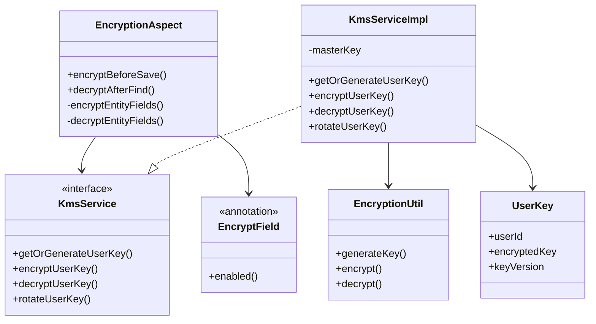
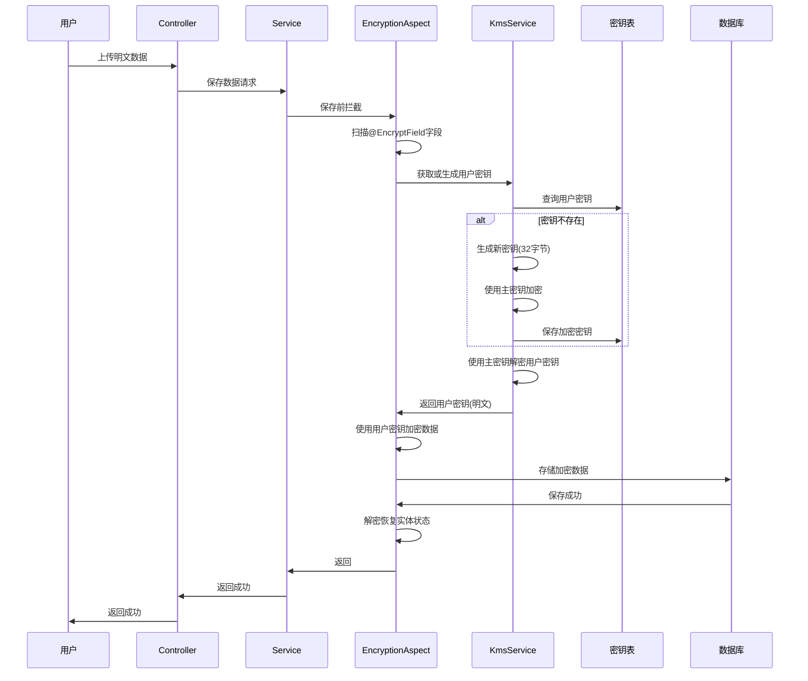
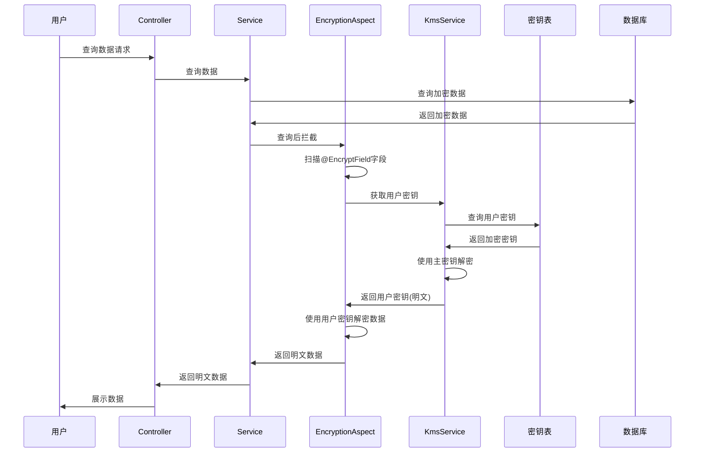
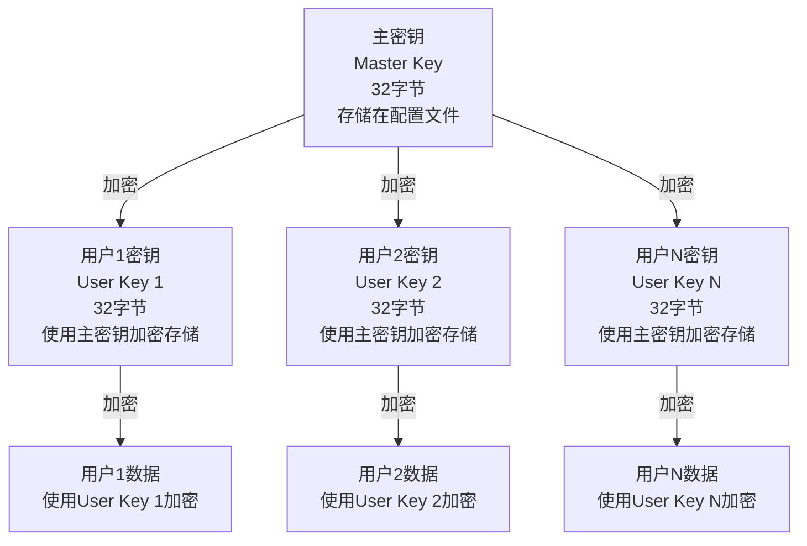

# KMS加密系统技术文档

## 目录

1. [概述](#概述)
2. [架构设计](#架构设计)
3. [核心组件](#核心组件)
4. [数据流程](#数据流程)
5. [加密算法](#加密算法)
6. [密钥管理](#密钥管理)
7. [使用指南](#使用指南)
8. [配置说明](#配置说明)
9. [安全建议](#安全建议)

---

## 概述

KMS（Key Management Service）加密系统是一个基于自建密钥管理服务的数据加密解决方案，为应用提供透明的字段级加密功能。系统采用AES-256-GCM加密算法，通过AOP切面技术实现自动加密/解密，无需修改业务代码即可保护敏感数据。

### 核心特性

- **透明加密**：通过注解标记需要加密的字段，自动处理加密/解密
- **用户级密钥**：每个用户拥有独立的加密密钥，提高安全性
- **密钥管理**：支持密钥生成、加密存储、版本管理和轮换
- **向后兼容**：支持未加密历史数据的兼容处理
- **高性能**：缓存机制优化，减少反射开销

---

## 架构设计

### 系统架构图

```mermaid
graph TB
    subgraph "应用层"
        Controller[Controller层]
        Service[Service层]
    end
    
    subgraph "加密层"
        Aspect[EncryptionAspect<br/>加密切面]
        Annotation[@EncryptField<br/>加密注解]
    end
    
    subgraph "KMS服务层"
        KmsService[KmsService<br/>密钥管理服务]
        EncryptionUtil[EncryptionUtil<br/>加密工具类]
    end
    
    subgraph "数据层"
        UserKeyRepo[UserKeyRepository<br/>密钥表]
        EntityRepo[EntityRepository<br/>业务数据表]
    end
    
    subgraph "存储层"
        KeyTable[(密钥表<br/>user_key)]
        DataTable[(业务数据表<br/>todo/user_info)]
    end
    
    Controller --> Service
    Service --> Aspect
    Aspect --> Annotation
    Aspect --> KmsService
    KmsService --> EncryptionUtil
    KmsService --> UserKeyRepo
    Service --> EntityRepo
    UserKeyRepo --> KeyTable
    EntityRepo --> DataTable
    
    style Aspect fill:#e1f5ff
    style KmsService fill:#fff4e1
    style EncryptionUtil fill:#fff4e1
```

### 组件关系图



---

## 核心组件

### 1. EncryptionAspect（加密切面）

**位置**：`cn.barcke.aspect.EncryptionAspect`

**职责**：
- 拦截JPA Repository的`save`方法，在保存前自动加密标记字段
- 拦截JPA Repository的`find*`方法，在查询后自动解密标记字段
- 使用反射扫描`@EncryptField`注解的字段
- 缓存实体类的加密字段信息，提高性能

**关键方法**：
- `encryptBeforeSave()`: 保存前加密
- `decryptAfterFindById()`: 查询后解密（单个实体）
- `decryptAfterFindAll()`: 查询后解密（集合）
- `decryptAfterFind()`: 查询后解密（自定义查询）

### 2. KmsService（密钥管理服务）

**位置**：`cn.barcke.service.KmsService`（接口）
**实现**：`cn.barcke.service.impl.KmsServiceImpl`

**职责**：
- 管理用户密钥的生成、存储、获取和轮换
- 使用主密钥加密/解密用户密钥
- 提供密钥版本管理

**关键方法**：
- `getOrGenerateUserKey(String userId)`: 获取或生成用户密钥
- `encryptUserKey(byte[] userKey)`: 使用主密钥加密用户密钥
- `decryptUserKey(String encryptedKey)`: 使用主密钥解密用户密钥
- `rotateUserKey(String userId)`: 密钥轮换

### 3. EncryptionUtil（加密工具类）

**位置**：`cn.barcke.tool.EncryptionUtil`

**职责**：
- 实现AES-256-GCM加密/解密算法
- 生成随机密钥
- 提供Base64编码/解码工具

**关键方法**：
- `generateKey()`: 生成32字节AES-256密钥
- `encrypt(String plaintext, byte[] key)`: 加密数据
- `decrypt(String ciphertext, byte[] key)`: 解密数据

### 4. @EncryptField（加密注解）

**位置**：`cn.barcke.annotation.EncryptField`

**用途**：标记实体类中需要加密的字段

**属性**：
- `enabled`: 是否启用加密（默认true）

**使用示例**：
```java
@EncryptField
@Column(name = "title")
private String title;
```

### 5. UserKey（密钥实体）

**位置**：`cn.barcke.pojo.UserKey`

**字段**：
- `userId`: 用户ID（唯一）
- `encryptedKey`: 加密后的用户密钥（使用主密钥加密）
- `keyVersion`: 密钥版本号（用于密钥轮换）

---

## 数据流程

### 数据保存流程



### 数据查询流程



---

## 加密算法

### AES-256-GCM

系统采用**AES-256-GCM**（Galois/Counter Mode）加密模式，具有以下特点：

1. **密钥长度**：256位（32字节）
2. **加密模式**：GCM模式，提供认证加密
3. **IV长度**：12字节（GCM推荐长度）
4. **认证标签**：16字节（防止数据篡改）

### 加密流程

```
明文数据
    ↓
生成随机IV（12字节）
    ↓
AES-GCM加密（使用用户密钥）
    ↓
组合：IV + 密文 + 认证标签
    ↓
Base64编码
    ↓
存储到数据库
```

### 解密流程

```
从数据库读取Base64密文
    ↓
Base64解码
    ↓
分离：IV + 密文 + 认证标签
    ↓
AES-GCM解密（使用用户密钥）
    ↓
验证认证标签
    ↓
返回明文数据
```

---

## 密钥管理

### 密钥层次结构



### 密钥生成

1. 使用`SecureRandom`生成32字节随机密钥
2. 使用主密钥加密用户密钥
3. 将加密后的密钥存储到`user_key`表

### 密钥存储

- **主密钥**：存储在`application.yml`配置文件中（Base64编码）
- **用户密钥**：存储在`user_key`表中，使用主密钥加密

### 密钥轮换

系统支持密钥版本管理和轮换：

1. 生成新密钥
2. 使用主密钥加密新密钥
3. 更新`user_key`表中的密钥和版本号
4. 旧数据仍可使用旧密钥解密（向后兼容）

---

## 使用指南

### 1. 为字段添加加密

在实体类的字段上添加`@EncryptField`注解：

```java
@Entity
@Table(name = "todo")
public class Todo {
    
    @EncryptField
    @Column(name = "title")
    private String title;
    
    @EncryptField
    @Column(name = "description")
    private String description;
}
```

### 2. 配置KMS

在`application.yml`中配置主密钥：

```yaml
kms:
  masterKey: YOUR_BASE64_ENCODED_32_BYTE_KEY
  enabled: true
```

### 3. 密钥轮换

通过KmsService进行密钥轮换：

```java
@Autowired
private KmsService kmsService;

// 轮换用户密钥
byte[] newKey = kmsService.rotateUserKey(userId);
```

### 4. 禁用加密

可以通过配置或注解禁用加密：

**全局禁用**：
```yaml
kms:
  enabled: false
```

**字段级禁用**：
```java
@EncryptField(enabled = false)
@Column(name = "field")
private String field;
```

---

## 配置说明

### application.yml配置

```yaml
kms:
  # 主密钥（Base64编码的32字节AES-256密钥）
  # 生产环境建议使用环境变量: ${KMS_MASTER_KEY}
  masterKey: Ud7h6c7R20wcycQOHv7xEBXsK0NAi9VWdRjBUTlgDe0=
  
  # 是否启用加密（默认启用）
  enabled: true
```

### 环境变量配置（推荐生产环境）

```yaml
kms:
  masterKey: ${KMS_MASTER_KEY}
  enabled: true
```

### 生成主密钥

使用Java代码生成主密钥：

```java
byte[] masterKey = EncryptionUtil.generateKey();
String base64Key = EncryptionUtil.keyToBase64(masterKey);
System.out.println("Master Key: " + base64Key);
```

---

## 安全建议

### 1. 主密钥安全

- **开发环境**：可以使用配置文件存储
- **生产环境**：强烈建议使用环境变量或密钥管理服务（如AWS KMS、Azure Key Vault）
- **密钥轮换**：定期轮换主密钥（需要迁移所有用户密钥）

### 2. 密钥存储

- 用户密钥使用主密钥加密后存储
- 主密钥不应存储在代码仓库中
- 使用密钥管理服务存储主密钥

### 3. 访问控制

- 限制KMS服务的访问权限
- 记录所有密钥操作日志
- 实现密钥访问审计

### 4. 数据迁移

- 新数据自动加密
- 旧数据保持兼容（解密失败时跳过）
- 建议逐步迁移旧数据到加密格式

### 5. 性能优化

- 缓存实体类的加密字段信息
- 批量操作时考虑性能影响
- 监控加密/解密操作耗时

---

## 技术栈

- **Spring Boot 3.5.3**
- **Spring AOP**：实现切面编程
- **JPA/Hibernate**：数据持久化
- **AES-256-GCM**：加密算法
- **Java 21**

---

## 常见问题

### Q1: 如何判断数据是否已加密？

A: 加密后的数据是Base64编码的字符串，长度通常比原文长。如果解密失败，系统会跳过（向后兼容）。

### Q2: 密钥丢失怎么办？

A: 如果主密钥丢失，无法解密用户密钥；如果用户密钥丢失，无法解密用户数据。建议：
- 备份主密钥到安全位置
- 定期备份密钥表
- 使用密钥管理服务

### Q3: 如何迁移旧数据？

A: 系统支持向后兼容，旧数据可以正常读取。建议：
1. 保持系统运行
2. 新数据自动加密
3. 逐步迁移旧数据（读取后重新保存）

### Q4: 性能影响如何？

A: 加密/解密操作有一定性能开销，但：
- 使用缓存减少反射开销
- GCM模式性能优于CBC模式
- 对于大多数应用，性能影响可接受

---

## 版本历史

- **v1.0** (2025/12/16)
  - 初始版本
  - 支持AES-256-GCM加密
  - 支持用户级密钥管理
  - 支持密钥版本管理和轮换
  - 支持注解式字段加密

---

## 参考资料

- [AES-GCM加密模式](https://en.wikipedia.org/wiki/Galois/Counter_Mode)
- [Spring AOP文档](https://docs.spring.io/spring-framework/reference/core/aop.html)
- [密钥管理最佳实践](https://owasp.org/www-project-key-management/)

